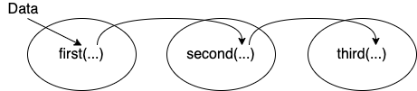

# Manipulating Data {#manipulate}

Data-preprocessing is an important step in any data science process. Rarely will you receive data that is in the exact form that you need. More often than not, you would need to pre-process the data by transforming and manipulating them so that they are easier to work with. This will be the focus in this chapter.

## Prerequisites

In this chapter we focus on the use of the **{dplyr}** package that forms a core part of the **{tidyverse}** package. **{dplyr}** provides function that alleviates the challenges of data manipulation. 

```{r, message=FALSE}
library(tidyverse)
library(lubridate)
library(here)
```

To explore the basic data manipulation capabilities of dplyr package, we will use the `building_meter` dataset. If the following code returns `FALSE`, you should refer to the section [Finding your file] in the [Preface] on where you can download the datasets. 

This dataset contains 8,760 time-series observations of typical building meter measurements that is simulated using the Department of Energy's (DOE) reference building energy model for medium sized offices [@deru_us_2011].

```{r}
bldg <- read_csv(here("data", "building_meter.csv"))
bldg
```

Non-word characters such as spaces may make it difficult to reference columns. Therefore, a basic rule is to avoid naming columns using names that contain these characters in the first place. However, sometimes it is out of your control because you did not create the dataset but received it from source where the naming was done by someone else. 

Take for example the `building.csv` data that we just parsed into R. `names()` when applied to a `data.frame()` returns the column names of the `data.frame`

```{r}
names(bldg)
```

An easy way to remove non-word characters is to use the `str_replace_all()` function to replace non-word characters with an underscore `_`. Referring back to Chapter \@ref{regex}, remember that `\\W` can be used to match non-word class of characters while `+` is a quantifies that can be used to match a pattern one or more times. Therefore, `str_replace_all(names(bldg), "\\W+", "_")` would replace all non-word characters that appear one or more times in the character vector `names(bldg)` with an underscore `_`.

```{r}
new_name <- str_replace_all(names(bldg), "\\W+", "_")
new_name
```

You can also remove parts of the character vector that you do not want using the function `str_remove_all()`.

```{r}
names(bldg) <- str_remove_all(new_name, "_Hourly_")
names(bldg)
```


## Data transformation

The [cheat sheet for dplyr](https://github.com/rstudio/cheatsheets/blob/master/data-transformation.pdf) provides a good summary of data transformation functions covered in this chapter.

- `select()`: To select columns based on their names.
- `filter()`: To subset rows based on their values.
- `mutate()`: To add new variables whose values are a function of existing variables.
- `arrange()`: To sort the dataset based on the values of selected columns
- `summarise()` and `group_by()`: To apply computations by groups
- `*_join()`: generic functions that joins two tables together

### `select()` {#select}
You can use the function `select()` to choose the variables to retain in the dataset based on their names. It is not uncommon to get datasets with hundred or thousands of variables. An example is when working with data from the building management system. Under these scenarios, it is often very useful to narrow down the dataset to contain only the variables of interest. `select()` allows you to do this very easily, to zoom in on the variables or columns of interest.

```{r}
select(bldg, Date_Time, Cooling_Electricity_J, Heating_Electricity_J)
```

You can also optionally rename columns with the `select()` function.

```{r}
select(bldg,
  datetime = Date_Time,
  cooling = Cooling_Electricity_J,
  heating = Heating_Electricity_J
)
```

Additionally, {tidyverse} provides helper functions that lets you select columns by matching patterns in their names. For the following selection helper functions, a character vector is provided for the match. If `length()` of the character vector is larger than 1, the logical union (OR `|` operator) is taken. 

* `starts_with()`: Select columns that starts with a specific character vector

```{r}
select(bldg, starts_with(c("Heating", "Cooling")))
```


* `ends_with()`: Select columns that ends with a specific character vector 

```{r}
select(bldg, ends_with("Time"))
```

* `contains()`: Select columns that contains a specific character vector 

```{r}
select(
  bldg,
  contains(
    c(
      "Time",
      "electricity"
    )
  )
)
```

* `matches()`: Select columns that matches a regular expression. `rename()` is a {dplyr} function that allows you to change the names of individual columns using `new_name` = `old_name`. Referring back to Chapter [regex], remember that the `.` is used to match any character except newline `\n` while `?` is a quantifier that can be used to match a pattern zero or one times. 

```{r}
reg_ex <- "[dD]ate.?[tT]ime"

select(bldg, matches(reg_ex, ignore.case = FALSE))

bldg_rename_a <- rename(bldg, `Date/Time` = `Date_Time`)
select(bldg_rename_a, matches(reg_ex, ignore.case = FALSE))


bldg_rename_b <- rename(bldg, `datetime` = `Date_Time`)
select(bldg_rename_b, matches(reg_ex, ignore.case = FALSE))
```

* `all_of()` and `any_of()`: You can also select variables from a character vector using the selection helper functions `all_of()` and `any_of()`. The key difference is that `all_of()` is used for strict selection where an error is thrown for variable names that do not exist. In contrast, `any_of()` does not check for missing variable names, and thus is often used to ensure a specific column is removed. 

```{r}
vars <- c("Heating_NaturalGas_J", "WaterSystems_NaturalGas_J")
select(bldg, all_of(vars))

select(bldg, -any_of(vars))
```

* `where()` is a very useful selection helper function when you want to apply a function (that returns `TRUE` or `FALSE`) to all columns and select only those columns where the function returns `TRUE`. 

```{r}
select(bldg, where(is.numeric))
```

You can also define the function to be applied within `where()`

```{r}

select(
  bldg,
  where(
    function(x) is.numeric(x)
  )
)
```

### `filter()`

You can use `filter()` to subset rows based on their values. dplyr's `filter()` function retains rows that return `TRUE` for all the conditions specified. The first argument is the data frame and the subsequent arguments are the conditions that are used to subset the observations. In other words, multiple arguments to `filter()` are combined by the `&` (and) logical operator. To work with other logical operators such as `|` (or) and `!` (not), you would have to combine them within a single argument. 

```{r}
filter(bldg, Cooling_Electricity_J != 0)

filter(bldg, InteriorLights_Electricity_J > 100000000)

filter(
  bldg, Cooling_Electricity_J != 0,
  Cooling_Electricity_J < 4000000 |
    Cooling_Electricity_J > 22000000,
)
```

Often, the ability to subset observations based on their timestamp is a very useful feature when working with timeseries data

```{r}
filter(bldg, month(Date_Time) == 1, day(Date_Time) == 1)

filter(bldg, day(Date_Time) == 1)

filter(bldg, month(Date_Time) > 4, month(Date_Time) < 10)

filter(bldg, month(Date_Time) > 4 & month(Date_Time) < 10)
```

You can also combine `filter()` with `grepl()` to subset rows using regular expressions.

### `arrange()`

You can use `arrange()` to sort the dataset based on the values of selected columns. The first argument is the data frame and the second is the column name to sort the data frame by. If more than one column name is provided, subsequent column names will be used to break ties in the preceding columns.

```{r}
arrange(bldg, Cooling_Electricity_J)
```

You can use `desc()` to order a column in descending order

```{r}
arrange(bldg, desc(Cooling_Electricity_J))
```

### `mutate()`

You can use `mutate()` to add new variables whose values are a function of existing variables (Note that you can also refer to newly created variables). The newly created variables will be added to the end of the dataset. 

```{r}
mutate(bldg,
  Total_Heating_J = Heating_NaturalGas_J + Heating_Electricity_J,
  Cooling_Heating_kWh = (Total_Heating_J + Cooling_Electricity_J) * 2.77778e-7
)
```

You can use `transmute()` if you only want to keep the new variables in your dataset. 

```{r}
transmute(bldg,
  Total_Heating_J = Heating_NaturalGas_J + Heating_Electricity_J,
  Cooling_Heating_kWh = (Total_Heating_J + Cooling_Electricity_J) * 2.77778e-7
)
```

Useful mutate and transmute functions include

- Arithmetic operators (`+`, `-`, *`, `/`, etc.) and logarithms (`log()`, `log2()`, etc.)

```{r}
heat <- transmute(bldg,
  Total_Heating_J = Heating_NaturalGas_J + Heating_Electricity_J
)
heat
```

- `lead()` and `lag()`, allowing you to create lead and lag variables that are useful especially when working with timeseries data.

```{r}
mutate(
  heat,
  lag_1 = lag(Total_Heating_J),
  lag_2 = lag(lag_1),
  lag_3 = lag(Total_Heating_J, 3)
)
```

- `if_else()` is function of the form `if_else(condition, true, false)` that allows you to test a condition that you provide as a first argument to the function. If the condition is `TRUE`, `if_else()` will return the second argument. By contrast, if the condition is `FALSE`, it will return the third argument. In the example below, we are using mutate to create a new variable/column `New_Total_Heating_J`. This new column will contain the characters `"low"` if the condition `Total_Heating_J < 200000000` is `TRUE` and `"high"` if it is `FALSE`.

```{r}
mutate(
  heat,
  New_Total_Heating_J = if_else(Total_Heating_J < 200000000, "low", "high")
)
```

- `case_when()` is an extension of `if_else()` by allowing you to write multiple `if_else()` statements. Below, we assign a `"low"` when `Total_Heating_J < 200000000`, `"medium"` when `200000000 <= Total_Heating_J <= 400000000`, and high when `Total_Heating_J > 400000000`.  

```{r}
mutate(
  heat,
  New_Total_Heating_J = case_when(
    Total_Heating_J < 200000000 ~ "low",
    Total_Heating_J >= 200000000 & Total_Heating_J <= 400000000 ~ "medium",
    Total_Heating_J > 400000000 ~ "high")
)
```

### `summarise()` and `group_by()`

`summarise()` or `summarize()` collapse a data frame into one row for each combination of grouping variables. Therefore, it is not very useful by itself. 

```{r}
summarise(bldg,
  Heating_Total = sum(Heating_Electricity_J),
  Heating_Avg = mean(Heating_Electricity_J),
  Heating_Peak = max(Heating_Electricity_J)
)
```

However, `summarise()` combined with `group_by()` will allow you to easily summarise data based on individual groups.

```{r}
bldg_month <- mutate(bldg,
  Year = year(Date_Time),
  Month = month(Date_Time)
)

bldg_by_month <- group_by(bldg_month, Year, Month)

summarise(bldg_by_month,
  Heating_Total = sum(Heating_Electricity_J),
  Heating_Avg = mean(Heating_Electricity_J),
  Heating_Peak = max(Heating_Electricity_J)
)
```

### `across()`

`across()` makes it possible to apply functions across multiple columns within the functions `summarise()` and `mutate()`, using the semantics in `filter()` (see section \@ref(select)) that makes it easy to refer to columns based on their names.  

```{r}
transmute(bldg,
  Date_Time,
  total = rowSums(across(where(is.numeric)))
)
```

You may also pass a list of functions to be applied to each of the selected columns.

```{r}
summarise(
  bldg_by_month,
  across(
    contains("electricity"),
    list(Total = sum, Avg = mean, Peak = max)
  )
)
```

##  Pipes

The `%>%` is a forward pipe operator from the `magrittr` package that comes loaded with the `tidyverse` package. The pipe operator `%>%` is a very handy that allows operations to be performed sequentially. In general, you can think of it as sending the output of one function as an input to the next . 

With the pipe operator, 

Instead of many intermediary steps
```{r, eval=FALSE}
first_output <- first(data)
second_output <- second(first_output)
final_result <- third(second_output)
```

You can connect multiple operators sequentially using the pipe operator
```{r, eval=FALSE}
final_result <- first(data) %>%
  second() %>%
  third()
```

Figure \@ref(fig:pipe) shows what is happening graphically.

```{r pipe, echo=FALSE, eval=TRUE, out.width = "70%", fig.cap="Piping data from one function to the next sequentially", fig.align='center'}

```

An example using the `bldg` dataset. 

```{r}

bldg %>%
  select(Date_Time, contains("Heating")) %>%
  mutate(
    Month = month(Date_Time),
    Total_Heating_J = rowSums(across(where(is.numeric)))
  ) %>%
  group_by(Month) %>%
  summarise(across(
    where(is.numeric),
    list(Total = sum, Peak = max)
  ))
```
