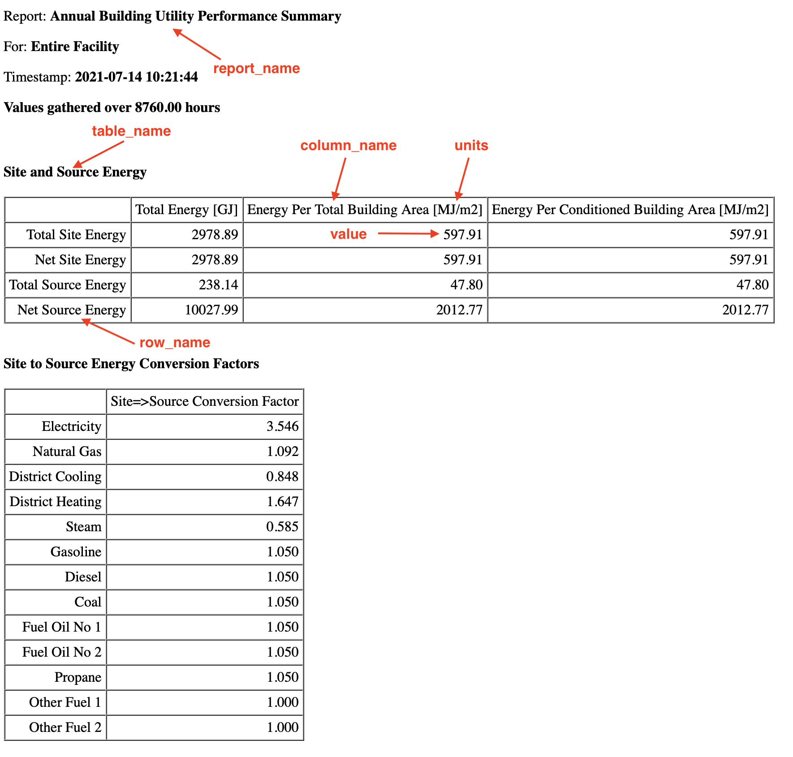

# Summary reports {#summary}

```{r, include=FALSE}
source("_common.R", local = knitr::knit_global())
```

## Prerequisites

In this chapter we will focus on how to set and get EnergyPlus simulation
outputs using the eplusr package. We will illustrate the manipulation of
simulation data using {tidyverse}, and use {ggplot2} to visualize the simulation
data

```{r, message=FALSE}
library(eplusr)
library(tidyverse)
library(ggplot2)
library(RColorBrewer)
library(here)
```

We will be working with the IDF and EPW file that pertains to the U.S.
Department of Energy (DOE) Commercial Reference Building and Chicago's TMY3
respectively.

```{r, message=FALSE}
path_idf <- here("data", "idf", "RefBldgMediumOfficeNew2004_Chicago.idf")
model <- read_idf(path_idf)

path_epw <- here("data", "epw", "USA_IL_Chicago-OHare.Intl.AP.725300_TMY3.epw")
epw <- read_epw(path_epw)
```

## Output summary reports

To output the summary reports from EnergyPlus, you need to first run the
simulation. The object `job` in the code below belongs to the `EplusJob` class.
If you set `dir = NULL`, the simulation results will not be saved into a
temporary directory but instead in the folder containing the IDF file. Do that
and you will find the summary report in a html file as illustrated in Figure
\@ref(fig:tabular-data).

```{r, out.lines = 15}
job <- model$run(epw, dir = tempdir())
class(job)
```

```{r tabular-data, echo=FALSE, eval=TRUE, out.width = "80%", fig.cap="Report summary html file output from EnergyPlus", fig.align='center'}

```

In eplusr, the `EplusJob` class provides different methods to extract simulation
results. To bring the summary reports into R, you can use the `tabular_data()`
method, which extracts all the EnergyPlus summary reports into a R `data.table`.

The data table consists of the following nine columns.

-   case: Name of the simulation case. The case variable is useful for filtering
    the simulation results when running multiple parametric simulations.
    However, since we are only running one simulation in this example there is
    only one unique case.
-   index: Row index for the table
-   report_name: Names of the summary report that the observation belongs to
-   report_for: The context that the summary report is for.
-   table_name: The name of the table within the report that the observation
    belongs to.
-   column_name: The name of the column within a table that the observation
    belongs to.
-   row_name: The name of the row within a table that the observation belongs
    to.
-   units: The unit of the observation.
-   value: The value of the observation. Note that by default, this is stored as
    a character vector.

```{r}
report <- job$tabular_data()
colnames(report)
```

To illustrate, refer back to Figure \@ref(fig:tabular-data) on what the
arguments `report_name`, `table_name`, `column_name`, `row_name`, `units`, and
`value` would correspond to in the html summary report. You can easily retrieve
the `Total Site Energy` in `Energy Per Total Building Area` from the
`Site and Source Energy` table in the `AnnualBuildingUtilityPerformanceSummary`
report. Note that there are no whitespaces when specifying the `report_name`.

```{r}
report_example <- report %>%
    filter(
        report_name == "AnnualBuildingUtilityPerformanceSummary",
        table_name == "Site and Source Energy",
        column_name == "Energy Per Total Building Area",
        row_name == "Total Site Energy"
    )
```

Other examples as follows.

You can retrieve end use energy consumption data and arrange them in descending
value.

```{r}
report_end_use <- report %>%
    filter(
        table_name == "End Uses",
        grepl("Electricity|Natural Gas", column_name, ignore.case = TRUE),
        !grepl("total", row_name, ignore.case = TRUE)
    ) %>%
    mutate(
        value = as.numeric(value) * 277.778,
        units = "kWh"
    ) %>%
    select(row_name, column_name, units, value) %>%
    rename(category = row_name, fuel = column_name) %>%
    arrange(desc(value)) %>%
    drop_na()
```

You can retrieve normalized metrics and group them by their fuel type.

```{r}
report_norm <- report %>%
    filter(
        table_name == "Utility Use Per Conditioned Floor Area",
        row_name != "Total"
    ) %>%
    mutate(
        value = as.numeric(value) * 0.2777777777777778,
        units = "kWh/m2"
    ) %>%
    filter(value > 0.0) %>%
    select(category = row_name, fuel = column_name, units, value) %>%
    group_by(category) %>%
    summarise(total = sum(value))
```

You can also retrieve details of the model inputs from the summary reports.

Opaque exterior of the building envelope.

```{r}
report_op_ext <- report %>%
    filter(
        table_name == "Opaque Exterior",
        grepl("Azimuth|U-Factor with Film", column_name)
    ) %>%
    mutate(value = as.numeric(value)) %>%
    select(row_name, column_name, units, value)
```

Exterior fenestration of the building envelope.

```{r}
report_ext_fenestration <- report %>%
    filter(
        table_name == "Exterior Fenestration",
        !grepl("total", row_name, ignore.case = TRUE)
    ) %>%
    mutate(value = as.numeric(value)) %>%
    filter(value > 0) %>%
    select(row_name, column_name, units, value)
```

You can refer to the section *"Output:Table:SummaryReports"* in EnergyPlus's
*"Output Details and Examples"* documentation for the list of available reports.
