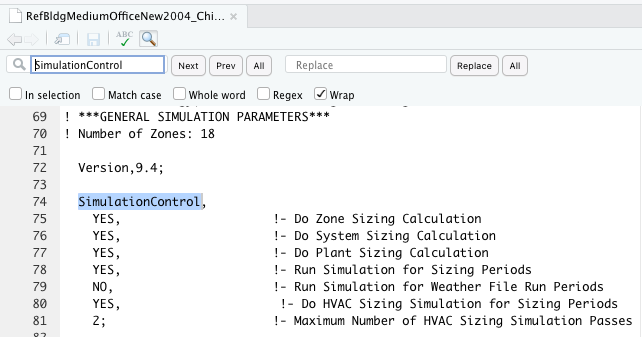
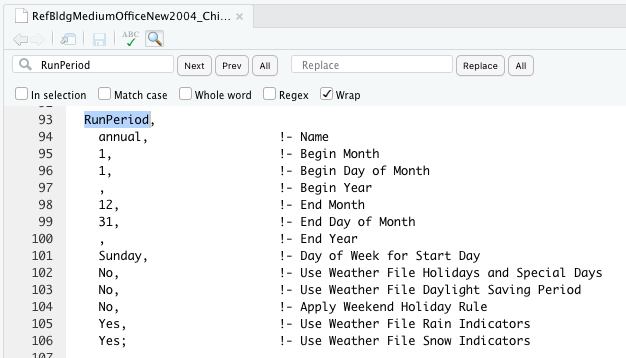

# Parse then simulate {#parse}

## Prerequisites

In this chapter we will introduce the **{eplusr}** package that was designed to interface with EnergyPlus and ease the application of data driven analytics. If you like to learn more about the underlying theory of how data is structured under the hood, you might enjoy the *{eplusr}* paper published in the Journal Energy and Buildings [@jia_eplusr_2021]. 

```{r}
library(eplusr)
library(here)
```

In this book, you will learn using the U.S. Department of Energy (DOE) Commercial Reference Building for medium office energy model [@deru_us_2011]. We use the DOE reference building because it is well established and widely used. More importantly, it is publicly available and comes distributed with EnergyPlus as example files, making the examples and code in this book easier to follow and reproduce. 

For your convenience, the model can be found at `./data/idf/RefBldgMediumOfficeNew2004_Chicago.idf` relative to the project root folder. Likewise, the weather file that we will be using can be found at `./data/epw/USA_IL_Chicago-OHare.Intl.AP.725300_TMY3.epw` relative to the project root folder.

## Key EnergyPlus files

Before starting to work with EnergyPlus, there are three main EnergyPlus files that you should know: the input data dictionary (IDD), the input data file (IDF), and the EnergyPlus weather file (EPW). All three files are ASCII files also know as text files. The IDD lists all possible objects in EnergyPlus along with their respective input requirements. The IDF provides a description of the building to be simulated. The EPW contains the hourly or sub-hourly weather data (i.e., the boundary conditions) needed for the simulation.

## Parsing the model

Before starting, you need to first tell R where EnergyPlus is located. By default, the eplusr package will try to locate all EnergyPlus installed in your computer. Versions of found EnergyPlus can be retrieved by running the `avail_eplus()` function.

```{r}
avail_eplus()
```

Alternatively, you can specify the location of the EnergyPlus you want to use.

```{r, eval = FALSE}
use_eplus("/Applications/EnergyPlus-9-4-0")
```

To get started, you need to first be familiar with the three basic classes (`Idf`, `Epw`, and the `EplusJob`) of the eplusr package. 

The `Idf` class is used to represent the EnergyPlus model. It contains methods that allows you to easily query and modify the model. You can use the `read_idf()` function to parse the EnergyPlus model into R by providing the file path to the EnergyPlus IDF file. You can use the function `here()` to easily reference the file path relative to the project root folder. 

```{r}
path_idf <- here("data", "idf", "RefBldgMediumOfficeNew2004_Chicago.idf")
model <- read_idf(path_idf)
```

The `Epw` class is used to represent the weather data that will be used for the simulation. You can use the `read_epw()` function to parse an EPW weather file into R by providing the file path to the EnergyPlus EPW file. Likewise, the function `here()` is used to easily reference the file path relative to the project root folder. 

```{r, message=FALSE}
path_epw <- here("data", "epw", "USA_IL_Chicago-OHare.Intl.AP.725300_TMY3.epw")
epw <- read_epw(path_epw)
```

The `EplusJob` is used extract the simulation results. When you run the model, a `EplusJob` object is returned. One way to run the model is to use the `$run()` method of the `Idf` class, and provide the weather file in the form of an `epw` object. 

```{r, eval = FALSE}
job <- model$run(weather = epw)
```

## Simulating the model

You should check the SimulationControl and RunPeriod objects in EnergyPlus before simulating the model. The SimulationControl object allows the user to specify the type of simulations that will be performed. You can view this object in R by navigating to and opening the `RefBldgMediumOfficeNew2004_Chicago.idf` file in R followed by searching for the string `SimulationControl` (Figure \@ref(fig:sim-control)). If the value for the `Run Simulation for Weather File Run Periods` field is `NO` as illustrated in Figure \@ref(fig:sim-control), the simulation will be **not** be run on for the weather file run periods (Figure \@ref(fig:run-period)). In other words, if you want to run the simulation based on the provided epw weather file for the period specify by the RunPeriod object, check that this field is set to `YES`.  

```{r sim-control, echo=FALSE, eval=TRUE, out.width = "80%", fig.cap="SimulationControl object in EnergyPlus.", fig.align='center'}

```


```{r run-period, echo=FALSE, eval=TRUE, out.width = "80%", fig.cap="RunPeriod object in EnergyPlus.", fig.align='center'}

```

You can use the `run()` method of the Idf class to run the simulation using EnergyPlus. You can choose the weather file to run the simulation by specifying an `Epw` object or a file path of an `.epw` file to the `weather` argument. You can also specify a directory to save the simulation results using the `dir` argument. By default, the folder of your Idf file is used to save the simulation results. 

```{r, eval = FALSE}
job <- model$run(weather = epw,
                 dir = here("data", "idf", "run", "test_run.idf"))
```

If you do not want to save the simulation results locally, you can save the simulation output files to a temporary directory by specifying `dir = tempdir()`.

```{r}
job <- model$run(epw, dir = tempdir())
```
