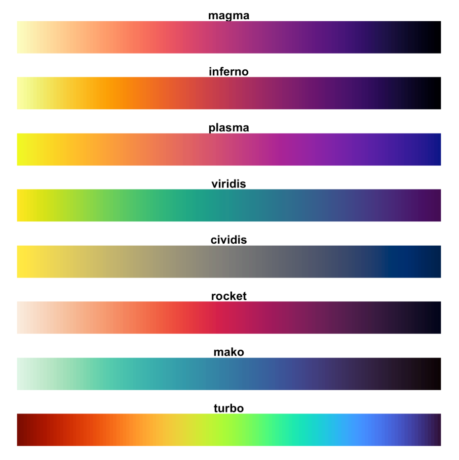

# Visualize {#visualize}

## Prerequisites

In this chapter, you will use the **{eplusr}** package to interface with EnergyPlus via R, the **{tidyverse}** package to manipulate the simulation results, and the **{here}** package to specify relative file paths. 

Additionally, we will introduce **{ggplot2}**, an input-tidy visualization package that is based on the the grammar of graphics [@wilkinson_grammar_2012]. We will also introduce **{RColorBrewer}** and **{viridis}** package that contains predefined color palettes that make it easy to pick the right one when creating graphics in R. 


```{r, message = FALSE}
library(ggplot2)
library(RColorBrewer)
library(viridis)
```

We will also be working with the following R packages in this chapter. 

```{r, message = FALSE}
library(eplusr)
library(tidyverse)
library(here)
library(lubridate)
```

In this chapter, you will also be working with the U.S. Department of Energy (DOE) Commercial Reference Building for medium office energy model [@deru_us_2011] and the third and latest typical meteorological (TMY3) weather data for Chicago. You will first parse the IDf and EPW to R and run the simulation to extract the simulation results.

```{r, message = FALSE, out.lines = 15}
path_idf <- here("data", "idf", "RefBldgMediumOfficeNew2004_Chicago.idf")
model <- read_idf(path_idf)

path_epw <- here("data", "epw", "USA_IL_Chicago-OHare.Intl.AP.725300_TMY3.epw")
epw <- read_epw(path_epw)

job <- model$run(weather = epw, dir = tempdir())
```

## Colors

Choosing the right color scheme is an important aspect of data visualization because of the effects they might have on our relative visual perception of luminance. To find out more, I recommend reading [Chapter 1 of Data Visualization: A practical introduction](https://socviz.co/lookatdata.html#lookatdata) by Kieran Healy [@healy_data_2018] that discusses aspects of perception and interpretation when creating graphics.

Fortunately, R has many pre-defined color palettes where careful thought has been put into their perception and aesthetic qualities. Specifically, the RColorBrewer package contains color palettes that have been carefully designed for discrete data. 

The RColorBrewer package provide three types of color palettes: sequential, diverging, and qualitative. You can view those palettes that are colorblind friendly. 

```{r, fig.height=10}
display.brewer.all(colorblindFriendly = TRUE)
```

When representing gradients (such as temperature data), you want to use *sequential* color palletes that are perceptually uniform as the color progresses from low to high. 

```{r, fig.height=7}
display.brewer.all(type="seq", colorblindFriendly=TRUE)
```

You will want to use *diverging* color palettes that uses a neutral mid-point that diverges at perceptually equal steps to both ends of the data. An example is using the `RdBu` color pallette to represent temperature data that diverges between cold and hot. 

```{r, fig.height=4}
display.brewer.all(type="div", colorblindFriendly=TRUE)
```

You will want to map categorical variables to *qualitative* color palettes that are perceptually uniform and not have any variables standing out perceptually due to it's color. For instance, when visualizing the energy usage intensity of different buildings, you would want the colors used to represent each building to be easily distinguishable but at the same time not have one stand out from another even though they are numerically equivalent. 

```{r, fig.height=3}
display.brewer.all(type="qual", colorblindFriendly=TRUE) 
```

You can use the function `display.brewer.pal()` to visualize a single brewer palette and use the `brewer.pal()` function to obtain the hexadecimade color code of the palette. 

```{r}
# display 5 colors from the "Set2" color palette
display.brewer.pal(5, "Set2")
```

```{r}
# return the hexadecimal code for 5 olors of the "Set2" palette
brewer.pal(5, "Set2")
```

Visualizing building related data such as electricity consumption often involves mapping continuous data onto the color or fill of the graphic you want to create. Although the brewer palettes can be extended to continuous data through interpololation, I have found the color scales in the viridis package to be more robust because they are designed to be perceptually uniform while maintaining a large range. The viridis package contains eight different color scales with the viridis scale forming the default or primary color map.


```{r viridis, echo=FALSE, eval=TRUE, out.height = "70%", fig.align='center'}

```

## `ggplot()`

### Functions and Components

All plots created by ggplot2 begins with a `ggplot()` function that initializes a ggplot plot object that can be used to specify how variables in the data are mapped to the "aesthetics" of the visualization. The function has two key arguements. The first argument `data` is the data frame that will be used for the plot. The second argument `mapping` is used to specify how variables in the data are mapped to the "aesthetics" of the visualization. The function `aes()` is a quoting function (i.e., the inputs are evaluated in the context of the data). This means that you can name the variables of the data frame directly within the `aes()` function.

```{r, eval=FALSE}
ggplot(data = <DATA>, mapping = aes(<x, y, ...>))
```

You can then specify the graph by adding one or more of the following components with `+`

* A layer that comprises of geometric objects or *geom*, statistical transformation or *stat*, and *position* adjustments. Typically, a layer will be created using a `geom_<function>()`
* *scale*s that map data values to visual properties such as color, fill, shape, and size. 
* A *coord*inate system that specifies how the coordinates of the data maps to the plot. Typically, Cartesian coordinates are used. However, other coordinate systems includes polar coordinates and map projections. 
* *facet*s that divides the data into subsets based on one or more discrete variables. These subsets of data are then displayed as subplots on the plot. 
* A *theme* that can be used to customize the non-data components of the plot such as titles, labels, fonts, background, gridlines, and legends. 

```{r, eval=FALSE}
ggplot(data = <DATA>, mapping = aes(<x, y, ...>)) +
    <GEOM_FUNCTION>(stat = <STAT>, position = <POSITION>) +
    <COORD_FUNCTION>(...) +
    <SCALE_FUNCTION>(...) +
    <FACET_FUNCTION>(...) +
    <THEME_FUNCTION>(...)
```

You will see the use of `ggplot()` and the above mentioned components more concretely as we go through the visualization recipes in the subsequent sections.

### Visualize end use

Bar graphs are a common way to visualize building simulation end use data. In this section, we will illustrate the use of ggplot and its various components using using the `report_end_use` data frame that was created in the preceding section.

```{r}
report <- job$tabular_data()

report_end_use <- report %>%
    filter(table_name == "End Uses", 
           grepl("Electricity|Natural Gas", column_name, ignore.case = TRUE),
           !grepl("total", row_name, ignore.case = TRUE)) %>%
    mutate(value = as.numeric(value)*277.778,
           units = "kWh") %>%
    select(row_name, column_name, units, value) %>%
    rename(category = row_name, fuel = column_name) %>%
    arrange(desc(value)) %>%
    drop_na()
```

You can create bar graphs by adding `geom_bar()`. By default, `stat = bin` in `geom_bar()` which gives the count in each `x`. However, when the data contains `y` values, you would want to use `stat = "identity"`.  

```{r}
ggplot(data = report_end_use, aes(x = category, y = value, fill = fuel)) +
    geom_bar(stat="identity")
```

By default, the bar charts would be stacked. In this scenario, we only have two groups of fuel, electricity and natural gas. However, when there are many groups, stacked bar charts can be difficult to visualize. You can place them side by side instead using `position = position_dodge()`.

```{r}
ggplot(data = report_end_use, aes(x = category, y = value, fill = fuel)) +
    geom_bar(stat="identity", position = position_dodge())
```

You can use scale to change the fill and colors of the bar chart. The `scale_*_brewer()` and `scale_*_viridis()` functions provides an easy way to specify palettes from the RColorBrewer and the viridis package respectively. Particularly, `scale_fill_brewer()` and `scale_fill_viridis()` provides mapping to ggplot's fill aesthetics while `scale_color_brewer()` and `scale_color_viridis()` provides mapping to ggplot's color aesthetics. 

```{r}
ggplot(data = report_end_use, aes(x = category, y = value, fill = fuel)) +
    geom_bar(stat="identity") + 
    # use palette argument to indicate the brewer palette to use
    scale_fill_brewer(palette = "Set2") 
```

```{r}
ggplot(data = report_end_use, aes(x = category, y = value, fill = fuel)) +
    geom_bar(stat="identity") + 
    # use option argument to indicate the color scale to use
    scale_fill_viridis(option = "cividis",
                       discrete = TRUE) 
```

You can flip how the data coordinates maps to plot to get horizontal bar plots with `coord_filp()`.

```{r}
ggplot(data = report_end_use, aes(x = category, y = value, fill = fuel)) +
    geom_bar(stat="identity", position = position_dodge()) + 
    scale_fill_brewer(palette = "Set2") +
    coord_flip()
```

You can divide the plot into various *facet*s by subsetting the plot based one or more discrete variables. In this example, we divide the plot row wise based on fuel type using `facet_grid()`.

```{r}
ggplot(data = report_end_use, aes(x = category, y = value)) +
    geom_bar(stat="identity", position = position_dodge()) + 
    coord_flip() +
    facet_grid(rows = vars(fuel))
```

As you probably have noticed. The x-axis labels are not legible due to overlapping when plotting the data as vertical bar charts.

You can use `theme()` and `element_text()` to change how the x-axis labels appear. In this case we are rotating it counter-clockwise by 90 degrees (`angle = 90`), vertically center justify the text (`vjust = 0.5`), and horizontally right justify the text (`hjust = 1`). For `vjust` and `hjust`, 0 and 1 refers to left and right justify respectively.  

```{r}
ggplot(data = report_end_use, aes(x = category, y = value, fill = fuel)) +
    geom_bar(stat="identity") + 
    scale_fill_brewer(palette = "Set2") +
    theme(axis.text.x = element_text(angle = 90, vjust = 0.5, hjust=1))
```

You can also use `theme()` together with various `element_*` functions to control elements of the plot title, legend, axis labels, borders, background, etc. You can find out more about the possible arguments to each `element_function()` by typing `?margin` into your console. `element_*` functions are used with `theme()` to specify the non-data components of the plot. There are four element functions and they are:

* `element_blank()`: to assign a blank
* `element_rect()`: for specifying borders and background
* `element_line()`: for specifying lines
* `element_text()`: for specifying text

```{r}
ggplot(data = report_end_use, aes(x = category, y = value, fill = fuel)) +
    geom_bar(stat="identity") + 
    scale_fill_brewer(palette = "Set2") +
    ggtitle("End Use") +
    theme(axis.text.x = element_text(angle = 90, vjust = 0.5, hjust=1),
          axis.title = element_text(face = "bold", 
                                    colour = "red",
                                    size = 20),
          axis.line = element_line(linetype = "dashed", 
                                   arrow = arrow()),
          plot.background = element_rect(fill = "grey"),
          legend.title = element_blank() # remove legend title
   )
```

### Visualize weather data

Weather is a critical input to building energy simulation because it form the boundary conditions of the simulation. Weather for an EnergyPlus simulation comes in an **E**nergy**P**lus **W**eather (EPW) format and often contains 8760 hours (or 8784 hours for a leap year) of weather data. Therefore, being able to visualize weather data is an important component when exploring building energy simulation data. 

Here, we demonstrate three useful graphics for visualizing weather data using outdoor dry bulb temperature as an example.

Before creating the graphics using ggplot, we need to first extract the weather data, which we can easily carry out using the `$data()` method since we have earlier parsed the EPW file into RStudio as an `Epw` object.

```{r}
class(epw$data())
head(epw$data())
```

```{r}
weather_data <- epw$data() %>%
    select(datetime, dry_bulb_temperature) %>%
    mutate(month = month(datetime, label = TRUE),
           day = day(datetime),
           wday = wday(datetime, label = TRUE),
           hour = hour(datetime))
```

In the subsequent graphics, we will be using various colors from the `Reds` color palette from RColorBrewer.

```{r}
# return the hexadecimal code for 5 olors of the "Set2" palette
brewer.pal(8, "Reds")
display.brewer.pal(8, "Reds")
```

You can visualize the weather data (dry bulb temperature in this example) as a single time series plot. Here, `geom_line()` is used to connect the observations sequentially over time. `expression()` is used to express the degree symbol in the y-axis label. 

```{r, fig.width = 16}
ggplot(weather_data, aes(x = datetime, y = dry_bulb_temperature)) +
    geom_line(color = "#FB6A4A") +
    xlab("Time (Hours)") +
    ylab(expression("Dry bulb temperature " ( degree*C)))
    
```

You can also visualize the data by the hour of the day using scatterplots. To avoid overplotting, a typical problem with scatterplots, you can subset the data by their month using `facet_grid()`. To further aid the ability to visually identify patterns in the presence of overplotting, you can use `geom_smooth()` to add a smoothed line on top of the scatterplot. 

```{r, fig.width = 10}
ggplot(weather_data, aes(x= hour, y = dry_bulb_temperature)) +
    geom_point(color = "#FCBBA1", alpha = 0.7, size = 0.5) +
    geom_smooth(color = "#EF3B2C") +
    facet_grid(cols = vars(month)) +
    xlab("Hour of the day") +
    ylab(expression("Dry bulb temperature " ( degree*C)))
```

Last but not least, you can create heatmaps using the function `geom_tile()`. 

```{r, fig.width = 10}
ggplot(weather_data, aes(x = day, y = hour, fill = dry_bulb_temperature)) +
    geom_tile() +
    scale_fill_viridis(name = expression(degree*C),
                       option = "plasma") +
    facet_grid(cols = vars(month)) +
    ylab("Hour of the day") +
    xlab("Day of the week") 

```

### Saving Plots

You can use the `ggsave()` function to save the plot. By default, it saves the last plot that was displayed. You can specify the size of the graphic using the units ("in", "cm", "mm", or "px"), width and height argument. 

```{r, eval=FALSE}
ggsave("my_plot.pdf", width = 16, height = 24, units = "cm")
ggsave("my_plot.png", width = 6, height = 9, units = "in")
```
