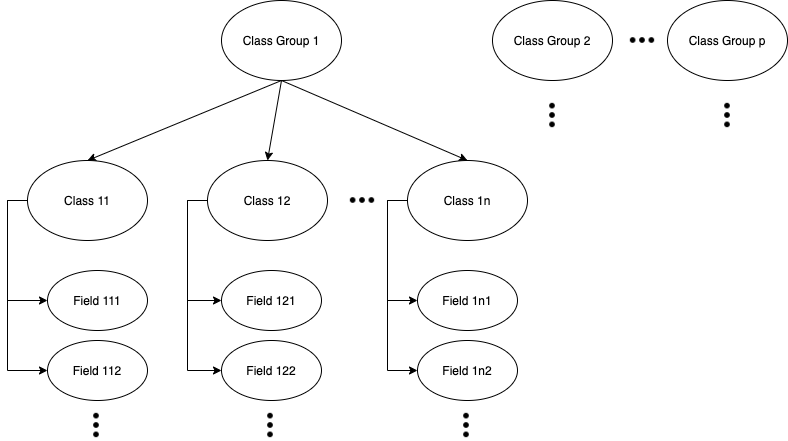
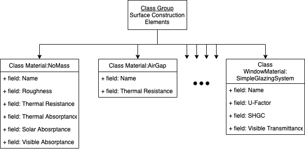
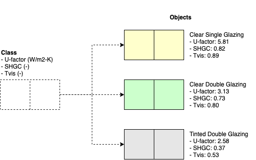
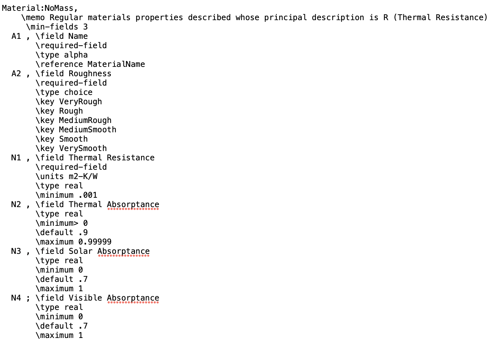

# Model Input Structure {#input}

```{r, include=FALSE}
source("_common.R", local = knitr::knit_global())
```

## Prerequisites

In this chapter, we will use the **{eplusr}** package to extract various inputs in an EnergyPlus model, and through this, learn how the inputs in EnergyPlus are structured.

```{r, message=FALSE}
library(eplusr)
library(here)
```

We will be working with the IDF and EPW file that pertains to the U.S. Department of Energy (DOE) Commercial Reference Building and Chicago's TMY3 respectively.

```{r, message=FALSE}
path_idf <- here("data", "idf", "RefBldgMediumOfficeNew2004_Chicago.idf")
model <- read_idf(path_idf)

path_epw <- here("data", "epw", "USA_IL_Chicago-OHare.Intl.AP.725300_TMY3.epw")
epw <- read_epw(path_epw)
```


## EnergyPlus Documentation

Although the focus of this chapter is to elucidate how the model inputs are structured to facilitate querying and modifying them, it is also important to understand what each input means. Fortunately, EnergyPlus is well documented and these documentation comes downloaded with any installation of EnergyPlus. You will find these documents within EnergyPlus's installation folder. By default, EnergyPlus will be installed in `C:\EnergyPlusVX-Y-0` on Windows, `/usr/local/EnergyPlus-X-Y-0` on Linux and `/Applications/EnergyPlus-X-Y-0` on macOS).

I would highly recommend referring to the EnergyPlus input output reference (`[EnergyPlus installation folder] > Documentation > InputOutputReference.pdf`), which provides a thorough description of every field for every input object in EnergyPlus. 

For those who find that the input output reference does not satisfy your inquisitive mind, I would recommend reading the EnergyPlus engineering reference (`[EnergyPlus installation folder] > Documentation > EngineeringReference.pdf`), which provides insights into the theoretical basis behind various EnergyPlus calculations.

## EnergyPlus input structure

In EnergyPlus, the inputs to the model can be categorized hierarchically where the top level is known as the class groups (Figure \@ref(fig:group-class-field)). Each class group consists of multiple input classes that are identifiable by their class names. Each class is then defined by fields that may or may not be required. Required fields as it's name suggest are field that must have a value. If the field is left blank and there are no pre-defined default values, an error will be raised when the simulation is run. 

```{r group-class-field, echo=FALSE, eval=TRUE, fig.cap = "Hierarchical model inputs organizational structure.", out.width = "80%", fig.align='center'}

```

Figure \@ref(fig:input-structure) illustrates this using the class group `Surface Construction Elements` in EnergyPlus. The `Surface Construction Elements` class groups consists of several classes that include the `Material:NoMass`, `Material:AirGap`, and the `WindowMaterial:SimpleGalzingSystem` class among others. Each class is then defined by their respective fields. For example, the `WindowMaterial:SimpleGalzingSystem` class is defined by a unique `Name`, the `U-Factor`, `SHGC` or Solar Heat gain Coefficient, and the `Visible Transmittance of the glazing system. 

```{r input-structure, echo=FALSE, eval=TRUE, fig.cap = "Categorization of EnergyPlus inputs", out.width = "80%", fig.align='center'}

```

## Class vs Object

In this book, we make a distinction between classes and objects following the terminologies of object-oriented programming (OOP). The difference between classes and objects is subtle yet conceptually simple. You can think of a class as a blueprint or template for creating objects. The created objects are therefore instances of the class. For example, when modeling glazing systems from the perspective of running an energy simulation, the thermal properties of the glazing system would be required for the calculations. Different glazing systems would have different thermal properties, which include the U-factor, solar heat gain coefficient (SHGC), and visible transmittance ($T_{vis}$). However, these properties although having different values, are a common characteristic across different glazing systems. Therefore, a glazing system class with the variables U-factor, SHGC, and $T_{vis}$ can be used as a template to create various glazing objects. 

```{r class-object, echo=FALSE, eval=TRUE, fig.cap = "Figure shows how three different glazing objects can be created from a glazing class, which acts as the template.", out.width = "80%", fig.align='center'}

```

## Model Query

### `Idf` class methods

Since the EnergyPlus model is organized hierarchically, we will demonstrate how to query the model hierarchically using the methods in the `Idf` class.


`Idf` Class Method     What it does
-------------------    -----------------------------------------------
`$group_name()`        Query the names of class groups
`$class_name()`        Query the names of classes
`$object_name()`       Query the names of objects in one or more classes
`$objects()`           Query one or more objects using their names


You can see what class groups exists in your model with the `$group_name()` method

```{r out.lines = 4}
model$group_name()
```

You can also view the list of classes in the model grouped by their corresponding class group.

```{r, out.lines = 10}
model$class_name(by_group = TRUE)
```

You can also view the list of objects that have been defined in a particular class in the model using the `$object_name()` method. The example from the code chunk below tells us that there are currently two materials (`CP02 CARPET PAD` and `MAT-AIR-WALL`) that have been created using the `Material:NoMass` class. You can think of these classes as templates for creating objects that defines your model as explained in the previous sub-section. In this particular example, the two material objects `CP02 CARPET PAD` and `MAT-AIR-WALL` are instances in the model that have been defined based on the `Material:NoMass` class. 

```{r}
model$object_name("Material:NoMass")
```

You can also query multiple classes.

```{r}
model$object_name(c("Material", "Construction"))
```

Finally, you can also query individual objects using the `$objects()` method.

```{r}
model$objects(c("Steel Frame Non-res Ext Wall", "IEAD Non-res Roof"))
```


### `$` operator

{eplusr} lets you to query model elements by names using the `$` operator, just like a normal named list in R. For instance, you can access the objects defined using the `Material:NoMass` class with `$Material:NoMass`. Since class, object, and field names in EnergyPlus often violets the variable naming restrictions in R (e.g., containing special characters such as `:`, white spaces, etc.), the identifiers need to be placed within a set of single back quotes ``` ` ``` to tell R that this is a variable name. 

With ``` $`Material:NoMass` ``` will list all the objects in the `Material:NoMass` class. 

```{r}
model$`Material:NoMass`
```

Since the model is stored hierarchically, you can chain them by adding another `$` to access and modify lower levels. Using the same example, you will be able to retrieve the `CP02 CARPET PAD` object with ``` $`Material:NoMass`$`CP02 CARPET PAD` ```.

```{r}
model$`Material:NoMass`$`CP02 CARPET PAD`
```

Likewise, you could go further down the hierarchy and extract the value of a particular field of an object by further chaining with another `$`. The example below shows that the `Thermal Resistance` value of the `CP02 CARPET PAD` object that was defined using the `Material:NoMass` class is `0.2165`. 

```{r}
model$`Material:NoMass`$`CP02 CARPET PAD`$`Thermal Resistance`
```

You can use the `definition` method that returns the fields needed as inputs to define a particular class.

Now, compare the output from the code chunk below with Figure \@ref(fig:input-structure). The required fields are indicated by `eplusr` using an asterix `*`. Using the `Material:NoMass` class as an example (Figure \@ref(fig:idd-nomass)), the same information can be obtained from the IDD file (`Energy+.idd`) where the required fields are indicated with the `\required-field` tag. The definitions of the different tags can be found at the begining of the IDD file. 

```{r, out.lines = 20}
model$definition("Material:NoMass")
```

```{r idd-nomass, echo=FALSE, eval=TRUE, fig.cap = "Screen capture of the definition of the Material:NoMass class from the EnergyPlus IDD file (`Energy+.idd`)", fig.align='center'}

```

## Object interdependencies

The inter-dependencies between different objects is a challenging aspect when working with energy models. It is important to note that changing an object not only affects the object but also the objects that reference it. A classic example is the relationship between the building's thermal zones, surfaces, construction, and materials. A single building energy model comprises of one or more thermal zones and each thermal zone has it's boundaries defined by several surfaces. Each surface is then assigned one construction where each layer of the construction is a material that is defined based on it's thermal properties.

Using the construction `Steel Frame Non-res Ext Wall` as an example. You can see that it references the materials `Wood Siding`, `Steel Frame NonRes Wall Insulation`, and `1/2IN Gypsum`. Likewise, it is referenced by the surfaces `Steel Frame Non-res Ext Wall`, `Perimeter_bot_Plenum_Wall_North`, ..., `Perimeter_top_ZN_4_Wall_West`. Therefore, changing the thermal properties of either of the three materials `Wood Siding`, `Steel Frame NonRes Wall Insulation`, and `1/2IN Gypsum` would change the thermal properties of the `Steel Frame Non-res Ext Wall` Construction and subsequently all the surfaces that references it. On a different note, changing an object's name would also require updating all the fields in the model that references the object. In this example, changing `Steel Frame Non-res Ext Wall` to `Steel Frame Non-res Wall` would require updating all the `Construction Name` field in the surfaces that references it, otherwise, a severe error would be raised when the simulation is run. 

```{r}
model$object_relation("Steel Frame Non-res Ext Wall")
```

In EnergyPlus, each object may be referenced by other

```{r}
model$object_relation("Window Non-res Fixed")
```
