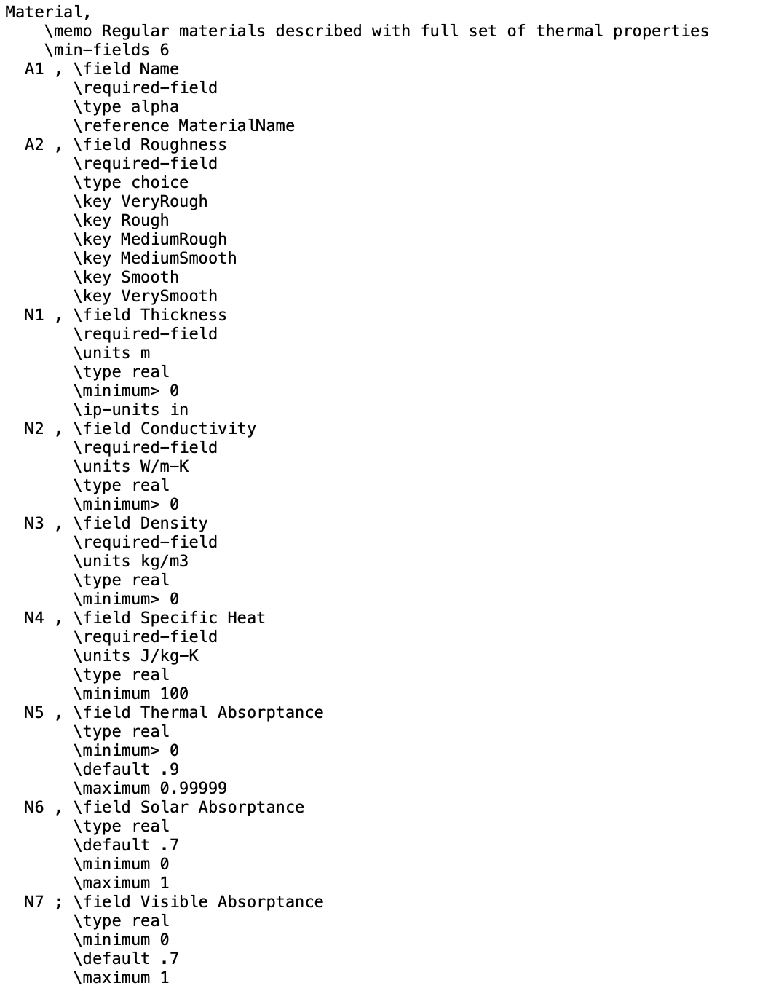

# Modify model inputs {#modify}

In this chapter, you will learn how modify the model inputs.

## Prerequisites

In this chapter, we will use the **{eplusr}** package to query and modify various inputs in an EnergyPlus model. We will also combine what you have learned about data manipulation (with the **{tidyverse}** package) to make it easier to work with the simulation inputs. 

```{r, message=FALSE}
library(eplusr)
library(tidyverse)
library(here)
```

We will be working with the IDF and EPW file that pertains to the U.S. Department of Energy (DOE) Commercial Reference Building and Chicago's TMY3 respectively.

```{r, message=FALSE}
path_idf <- here("data", "idf", "RefBldgMediumOfficeNew2004_Chicago.idf")
model <- read_idf(path_idf)

path_epw <- here("data", "epw", "USA_IL_Chicago-OHare.Intl.AP.725300_TMY3.epw")
epw <- read_epw(path_epw)
```

## Extract and Modify 

Changing the values of the existing objects in the model is an important functionality in the application of data exploration and data science to EnergyPlus. There are many approaches to extract and modify an EnergyPlus model using {eplusr}. In this chapter we focus on 

* Directly extracting and modifying the field values of a single object using the `[[` or `$` operator.

* Extracting and modifying multiple objects using the methods in the `Idf` class. Type `?Idf` in your console to see the `Idf` class methods.

### Single object

Like how you can access the field values of the model using the `$` operator, you can likewise modify them simply by accessing and then replace the current value by assigning a different value. For instance, you can change the `Thermal Resistance` field value of the `CP02 CARPET PAD` object to `0.5` using the `<-` operator to assign `0.5` to the field `Thermal Resistance`.

```{r}
model$`Material:NoMass`$`CP02 CARPET PAD`$`Thermal Resistance` <- 0.5
model$`Material:NoMass`$`CP02 CARPET PAD`
```

Another example showing how you can modify the lighting power density (field name: `Watts_per_Zone_Floor_Area`) of a particular zone (object name: Perimeter_bot_ZN_1_Lights) from `10.76` (current value) to `15` (new value).

Existing field values of the object `Perimeter_bot_ZN_1_Lights`, an instance of the `Lights` class.

```{r}
model$Lights$Perimeter_bot_ZN_1_Lights
```

Changing the value of the field `Watts_per_Zone_Floor_Area` from it's existing value of `10.76` to `15`.

```{r}
model$Lights$Perimeter_bot_ZN_1_Lights$Watts_per_Zone_Floor_Area <- 15
model$Lights$Perimeter_bot_ZN_1_Lights
```

### Multiple objects

Methods to extract data:

Methods          Description                                                
--------------   ------------------------------------------------------
`$to_table()`    Extract specified objects of the model to data.frames     
`$to_string()`   Extract specified objects of the model to strings

You can extract the EnergyPlus objects of interest into a R data frame using the `$to_table` method in the `Idf` class. If no arguments are provided to the method, the entire EnergyPlus model is converted to a data frame.

The data frame consists of the following six columns. 
 
* id (integer): Integer identifiers of the EnergyPlus objects.
* name (character): Names of the EnergyPlus objects.
* class (character): The class that the EnergyPlus object belongs to.
* index (integer): Row index for the field of a particular EnergyPlus object. 
* field (character): The name of the column within a table that the observation belongs to. 
* value (character): The value of the field.

Take a minute now to open the EnergyPlus IDF file (`"RefBldgMediumOfficeNew2004_Chicago.idf"`). Compare the text file with the data frame below, and identify where the values for the columns `class`, `name`, and `field` would correspond to in the IDF text file. You will also notice that some of the EnergyPlus classes such as `Version` and `SimulationControl` do not have a `name` field, which explains why it is stored as `NA` in the data frame.  

```{r}
model$to_table()
```

* Subset by Class

Working with the entire model can be difficult due to the large number of rows. You can extract all the objects belonging to a class by supplying a character vector of class names that are of interest to the argument `class`.

```{r}
model$to_table(class = c("Construction", "Lights"))
```

You can also extract particular objects from different classes by supplying a character vector of object names to the argument `which`.

```{r}
model$to_table(which = c("Wood Siding", 
                         "Steel Frame NonRes Wall Insulation", 
                         "1/2IN Gypsum"))

model$to_table(which = c("Perimeter_bot_ZN_1_Lights"))
```

Once the EnergyPlus objects are in a `data.frame` format, you can take advantage of the {tidyverse} library to easily manipulate and modify their values. For example, you can use the `filter()` function to subset the data frame to retain rows of interest and the `mutate()` function to modify values within columns. 

In the example below, we first extract all objects in the `Lights` class from the EnergyPlus model. We then filter the data frame to contain only the field `"Watts per Zone Floor Area"`, which is used to specify the lighting power density in $W/m^2$ in EnergyPlus. Lastly, we change the lighting power density of all the objects in the `Lights` class from $10.76 \mathrm{W}/\mathrm{m}^2$ to $15 \mathrm{W}/\mathrm{m}^2$.

```{r}
lights_df <- model$to_table(class = c("Lights")) %>%
  mutate(value = if_else(field == "Watts per Zone Floor Area", # condition
                         "15", # value if TRUE
                         value) # value if FALSE
 )

lights_df
```

However, notice that you are not modifying the model just by changing the values of the data frame. This is not surprising since the extracted data frame is a copy of the model and not the model itself. 

```{r}
model$`Lights`
```

To modify the model, you need to use the `$update()` method in the `Idf` class, which can take the modified data frame as an argument.  

```{r}
model$update(lights_df)
model$`Lights`
```

* Subset by Objects

You can also extract data from the EnergyPlus model based on the object names by supplying the object names to the argument `which` of the `$to_table()` method. In the example that follows, we will show you how to do this by changing the thermal properties of the external wall construction.

First, you can find out which `Construction` objects make up the external wall by scanning objects from the `BuildingSurface:Detailed` class, which describes all the surfaces of the model. In general, the external wall surfaces would be those that are of `Surface Type == Wall` and `Outside Boundary Conditions == Outdoors` (i.e., the surface is exposed to outside temperature conditions). In this model, the external wall is made up of the `Steel Frame Non-res Ext Wall` object of the `Construction` class. 

```{r}
ext_wall_surf <- model$to_table(class = c("BuildingSurface:Detailed"), wide =TRUE) %>%
  filter(`Surface Type` == "Wall", `Outside Boundary Condition` == "Outdoors")

unique(ext_wall_surf$`Construction Name`)
```

The object `Steel Frame Non-res Ext Wall` comprises of three materials (`Wood Siding`, `Steel Frame NonRes Wall Insulation`, and `1/2IN Gypsum`) that are modeled using the class `Material`. To modify the thermal properties of the external wall, you would need to modify the inputs of either of these three materials.  

```{r}
model$object_relation("Steel Frame Non-res Ext Wall")
```

We first extract these three materials from the model. 

```{r}
ext_wall_mat <- model$to_table(which = c("Wood Siding",
                                         "Steel Frame NonRes Wall Insulation",
                                         "1/2IN Gypsum"))
ext_wall_mat
```

You can then modify the extracted information in the `data.frame`. Here, we increase the `Conductivity` of the `1/2IN Gypsum` from `0.16` to `0.20`, and double the `Thickness` of the wall insultion (`Steel Frame NonRes Wall Insulation`).

```{r}

ext_wall_mat[name == "1/2IN Gypsum" & field == "Conductivity"]$value <- "0.20"

ext_wall_mat[name == "Steel Frame NonRes Wall Insulation" & 
               field == "Thickness"]$value <- "0.174"
```

Subsequently, you can update the model using the modified `data.frame` with the `$update()` method in the `Idf` class. 

```{r}
model$update(ext_wall_mat)

model$Material$`1/2IN Gypsum`

model$Material$`Steel Frame NonRes Wall Insulation`
```

## Create new objects

### add

You can add new objects to the model using the `$add()` method in the `Idf` class. The `$add()` method takes as it's first argument is a nested named list of the form. Note that `<CLASS NAME>` is case-sensitive while `<FIELD NAME>` is not.

```{r, eval=FALSE}
`list(<CLASS NAME> = list(<FIELD NAME> = <FIELD VALUE>))`
```

Suppose you want to add a new material to your model, which you can define using EnergyPlus's `Material` class. Figure \@ref(fig:idd-material) can be translated to tell us that the `Material` class consists of the following fields

* `Name` is a required field of type `alpha` (i.e., a string)
* `Roughness` is a required field of type `choice` and the possible choices are `VeryRough`, `Rough`, `MediumRou.gh`, `MediumSmooth`, `Smooth`, and `VerySmooth`.
* `Thickness` is a required field with unit of measurement meters. It is a `real` number and must be $>=0$ 
* `Conductivity` is a required field with unit of measurement $\mathrm{W}/\mathrm{m}\cdot\mathrm{K}$. It is a `real` number and must be $>=0$ 
* `Density` is a required field with unit of measurement $\mathrm{kg}/\mathrm{m}^3$. It is a `real` number and must be $>=0$ 
* `Specific Heat` is a required field with unit of measurement $\mathrm{J}/\mathrm{kg}\cdot\mathrm{K}$. It is a `real` number and must be $>=100$ 
* `Thermal Absorptance` is *not* a required field. It is a `real` number, has a default value of 0.9 if not specified, and must be between 0 and 0.99999.
* `Solar Absorptance` is *not* a required field. It is a `real` number, has a default value of 0.7 if not specified, and must be between 0 and 0.99999.
* `Visible Absorptance` is *not* a required field. It is a `real` number, has a default value of 0.7 if not specified, and must be between 0 and 0.99999.

```{r idd-material, echo=FALSE, eval=TRUE, fig.cap = "Definition of EnergyPlus Material class based on the IDD.", out.width = "70%", fig.align='center'}

```

Based on the definitions provided in the IDD, you can define and add a new 100mm brick object. By default, all empty fields will be filled with default values specified in the IDD. As mentioned earlier, note that the class name (`Material` in this example) is case-sensitive, while the field names (`Name`, `Roughness`, `Thickness`, etc.) are case-insensitive. 

```{r}
new_mat <- list(
  Material = list(
    Name = "100mm brick",
    ROUGHness = "Rough",
    thickness = 0.10,
    conducTIVITY = 0.89,
    density = 1920,
    `Specific Heat` = 790
  ),
  Material = list(
    name = "spandrel glass",
    roughness = "smooth",
    thickness = 0.006,
    conductivity = 0.99,
    density = 2528,
    `Specific Heat` = 880
  ))

model$add(new_mat)

model$objects(c("100mm brick", "spandrel glass"))

```

By default, all empty fields will be filled with default values specified in the IDD and the object would be defined using only the minimum number of fields. You change change this by setting with `.default = FALSE` (no default values used) and `.all = TRUE` (all fields are added). 

### duplicate
