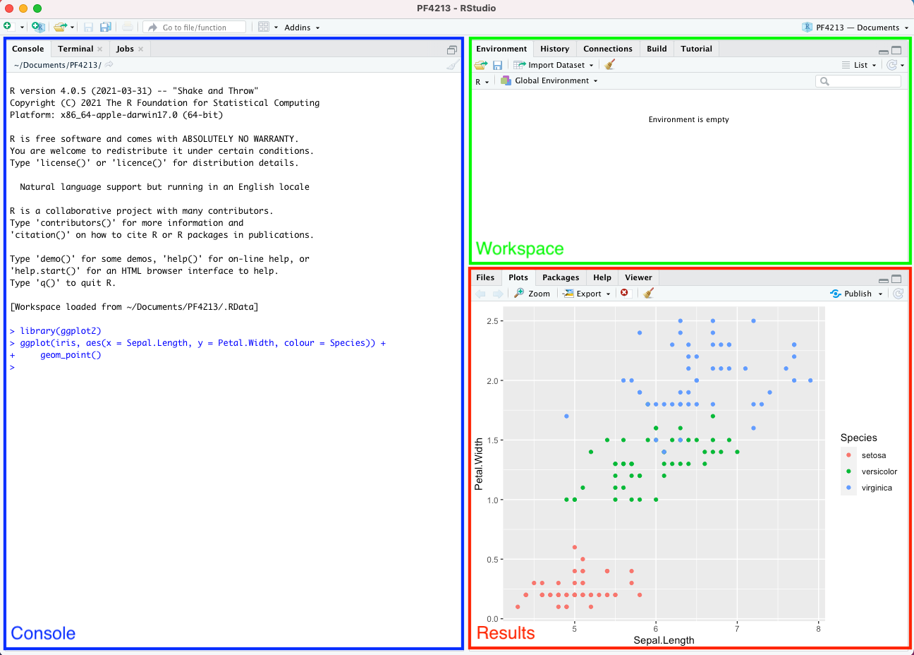
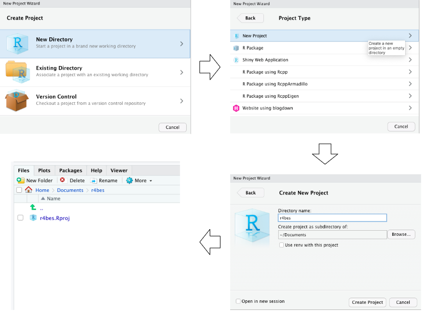

```{r, include=FALSE}
source("_common.R", local = knitr::knit_global())
```

# Preface {.unnumbered}

## Introduction {.unnumbered}

This is the book for the module **PF4213--Building Energy Analysis and
Simulation** at the Department of the Built Environment, National University of
Singapore. This book will introduce you to building energy simulation and how to
perform data analytics with energy models using R. You will learn how to get
your model into R, simulate it, transform the inputs and outputs, and visualize
and explore them. This book is designed to be interactive and for you to **learn
by doing**. It is highly recommended that you do not copy and paste all the code
in this book but instead type them out. Copying and pasting snippets of code
isn't the best way to learn because more often than not you are just reading the
code at an abstract level without understanding what it does. In contrast,
typing the code forces you to try to understand what the code is doing.

The online version of this book is free to use, and is licensed under the
[Creative Commons Attribution-NonCommercial-ShareAlike 4.0 International
License](https://creativecommons.org/licenses/by-nc-sa/4.0/).

*Note that this book is still work in progress and some chapters in the book are
currently just placeholders that will be completed over time.*

## Structure of this book {.unnumbered}

The book is divided into six parts. The code in each chapter is self-containing.
Each chapter will contain all the packages and objects needed to run the code
and objects created in previous chapters need not be carried over for them to
work.

[Part I](#r-basics) introduces R's basic syntax, which should be sufficient to
get most readers started on the subsequent parts of the book. [Part
II](#get-started) introduces the basic usage and will show you how to get your
EnergyPlus model into R, run the simulation, extract the predefined reports and
visuaize them. [Part III](#input-output) provide details on extracting and
modifying various model inputs/outputs, and provide examples of data exploration
that can be applied to the model inputs/outputs. [Part IV](#program) shows how
to programmatically define energy efficient measures using functions and
demonstrates the process of performing parametric simulation and it's analysis.
[Part V](#advanced) shows example application of advanced techniques such as
sensitivity analysis, optimization, and Bayesian calibration to building energy
simulation. [Part VI](#reproduce) introduces workflows and tools for reproducing
building energy simulation using R.

## Prerequisites {.unnumbered}

This book assumes some theoretical knowledge of building physics and building
energy simulation. Some programming experience is preferred but not necessary.
To run the code in this book, you will need to install **EnergyPlus**, **R**,
**RStudio**, and a handful of R packages that we will introduce as we go along
in this book.

### R and RStudio {.unnumbered}

To download and install the most recent version of R, I would recommend the
precompiled binary distribution of the base system and contributed packages that
you will find at the top of R's project webpage at
<https://cloud.r-project.org>. R Studio is an Integrated Development Environment
(IDE) for R.

R Studio increases your productivity when working with the R programming
language by combining different features such as syntax highlighting and
auto-completion into a single application. You can download and install RStudio
from <https://www.rstudio.com/products/rstudio/download>.

Once you have downloaded and installed RStudio, you will see a similar window to
that shown in image below that comprises of:

-   Console window: This is the window where you type in R code, press enter,
    and the results are returned.

-   Workspace window: The *Environment* tab in this window is where all the
    objects that you have created will show.

-   Results window: This window is typically used for visualizing graphs
    (*Plots* tab) and for getting help by accessing the documentation pages for
    R (*Help* tab).

```{r rstudio-console, echo=FALSE, eval=TRUE, out.width = "100%", fig.align='center'}

```

### R Packages {.unnumbered}

R has thousands of packages hosted on the **C**omprehensive **R** **A**rchieve
**N**etwork (CRAN). These packages contains functions developed and shared by
the community. In this book we will be using several R packages. The main
packages include the **tidyverse** and **eplusr** package. We will introduce the
other packages used in this book as we go along.

To install any R package, open R Studio and type

```{r, eval=FALSE}
install.packages("<package name>")
```

For example, to install the tidyverse package

```{r, eval=FALSE}
install.packages("tidyverse")
```

Note that you will not be able to use the R package until you load it into your
environment using the `library()` function. To load both the tidyverse package,
type

```{r, message=FALSE}
library("tidyverse")
library("eplusr")
```

### EnergyPlus {.unnumbered}

EnergyPlus is an open-source whole-building energy simulation engine that is
widely used by the research community and industry practitioners. EnergyPlus is
also the simulation engine supporting many energy simulation applications
[@noauthor_best_nodate], and it has been and continues to be supported by the
U.S. Department of Energy (DOE) [@noauthor_energyplus_nodate].

Different releases of EnergyPlus for different platforms (Windows, Linus, or
Mac) can be downloaded from <https://energyplus.net/downloads>. In this book, we
will be using EnergyPlus version 9.4.0.

You can also install EnergyPlus via RStudio using the eplusr package. First,
install eplusr

```{r, eval=FALSE}
install.packages("eplusr")
```

Then load the library onto RStudio

```{r, message=FALSE}
library(eplusr)
```

You can then install EnergyPlus version 9.4.0 by typing

```{r, eval=FALSE}
install_eplus(ver = 9.4)
```

## Conventions {.unnumbered}

In this book, code that you can type and run directly in R will appear within
grey boxes `like this` or in the form of code blocks like this:

```{r}
1 + 1
```

When presenting R code, prompts `>` will not be added and the output from
running the code will be commented out with `##` as shown in the example above.
This is for your convenience so that it is easy to type or copy the code so that
you can run it yourself.

## Before you begin {.unnumbered}

### R Project {.unnumbered}

The Figure below shows the steps to create a project called `r4bes` that you
will be using for this book. To create a project, select `File > New Project`
from RStudio's menu bar. This launches a window that provides you with options
for creating a project. Select the `New Directory` option followed by
`New Project`. You can then specify the `Directory name` for your new project
and the directory where it will reside. Notice the file with `.Rproj` extension
that was created along with the project. This is the project file that you
double-click to open a project. When you open a project, the current working
directory is automatically set to the project directory.

```{r create-project, echo=FALSE, eval=TRUE, out.width = "100%", fig.align='center'}

```

Try it now! Quite RStuido and then navigate to and open the `r4bes.Rproj` file.

### Scripting {.unnumbered}

Once the project folder is set up, you can create a new R Script with
`File > New File > R Script`. An R Script is basically a text file with a `.R`
extension that allows you to keep track and save your `R` code.

```{r script, echo=FALSE, eval=TRUE, out.width = "100%", fig.align='center'}

```

### Example files {.unnumbered}

To ensure the reproducibility of the examples in this book, you will download
the data folder from [this
link](https://www.dropbox.com/s/az2xh92pedhrzmk/data.zip?dl=0) and place it in
the project folder you have just created.

Your project folder should now have the following file structure.

```{r, eval=FALSE}
./r4bes/
  +-- r4bes.Rproj
  +-- data/
      +-- building_meter.csv
      +-- building.csv
      +-- epw
          +-- USA_IL_Chicago-OHare.Intl.AP.725300_TMY3.epw
      +-- idf
          +-- RefBldgMediumOfficeNew2004_Chicago.idf
      +-- iris.csv
```

`building_meter.csv` is an example energy meter output file from the the U.S.
DOE medium office energy model (i.e., `RefBldgMediumOfficeNew2004_Chicago.idf`).
The dataset has a temporal resolution of 1 hour and comprises of 10 variables
(the Date/Time and 9 other energy meters) and 8760 observations.

`building.csv` is a timeseries dataset from an actual building consisting of
1324 observations and 2 variables (date/time and building electricity
consumption). The dataset has a temporal resolution of 30 minutes.

`USA_IL_Chicago-OHare.Intl.AP.725300_TMY3.epw` is the latest Typical
Meteorological Year weather dataset for the Chicago Ohare International Airport.

`RefBldgMediumOfficeNew2004_Chicago.idf` is a building energy model developed by
the U.S. Department of Energy (DOE) to act as a Commercial Reference Building
for medium offices [@deru_us_2011]. We use the DOE reference building because it
is well established and widely used. More importantly, it is publicly available
and comes distributed with EnergyPlus as example files, making the examples and
code in this book easier to follow and reproduce.

`iris.csv` is a popular machine learning dataset about the Iris flower. The
dataset consists of 50 observations and 5 variables.

Once you have downloaded the `data` folder into your R project directure, the
following code should all return `TRUE`.

```{r}
library("here")

file.exists(here("data", "iris.csv"))
file.exists(here("data", "building.csv"))
file.exists(here("data", "building_meter.csv"))
file.exists(here("data", "idf", "RefBldgMediumOfficeNew2004_Chicago.idf"))
file.exists(here("data", "epw", "USA_IL_Chicago-OHare.Intl.AP.725300_TMY3.epw"))
```

### Project structure {.unnumbered}

You should also create a new folder called `R` in the newly created R project.
This folder will be used to house all `R` code that you will write as you go
through this book. You can create a new folder in RStudio by navigating to the
RStudio's results window, select the `Files` tab and click on `New Folder` and
enter `R`.

Your project folder should now look like this.

```{r file-structure, echo=FALSE, eval=TRUE, out.width = "30%", fig.align='center'}

```

### Style guide {.unnumbered}

We recommend using the [Tidyverse Style
Guide](https://style.tidyverse.org/index.html) by Hadley Wickham. To summarize
we recommend the following

-   R File names should be meaningful and end in `.R`. Avoid using special
    characters when naming files and use only `lowercase`, hyphens `-`, and
    underscores `_`.
-   `snake_case` (only lowercase letters, numbers, and `_`) for all object and
    function names. Function names should also reflect what it does.
-   Use two white spaces when indenting your code

```{r indent-space, echo=FALSE, eval=TRUE, out.width = "70%", fig.align='center'}

```

-   Line length should not exceed 80 characters

```{r line-length, echo=FALSE, eval=TRUE, out.width = "70%", fig.align='center'}

```

<!-- This is a _sample_ book written in **Markdown**. You can use anything that Pandoc's Markdown supports, e.g., a math equation $a^2 + b^2 = c^2$. -->

<!-- The **bookdown** package can be installed from CRAN or Github: -->

<!-- ```{r eval=FALSE} -->

<!-- install.packages("bookdown") -->

<!-- # or the development version -->

<!-- # devtools::install_github("rstudio/bookdown") -->

<!-- ``` -->

<!-- Remember each Rmd file contains one and only one chapter, and a chapter is defined by the first-level heading `#`. -->

<!-- To compile this example to PDF, you need XeLaTeX. You are recommended to install TinyTeX (which includes XeLaTeX): <https://yihui.org/tinytex/>. -->

```{r include=FALSE}
# automatically create a bib database for R packages
knitr::write_bib(c(
    .packages(), "bookdown", "knitr", "rmarkdown"
), "packages.bib")
```
